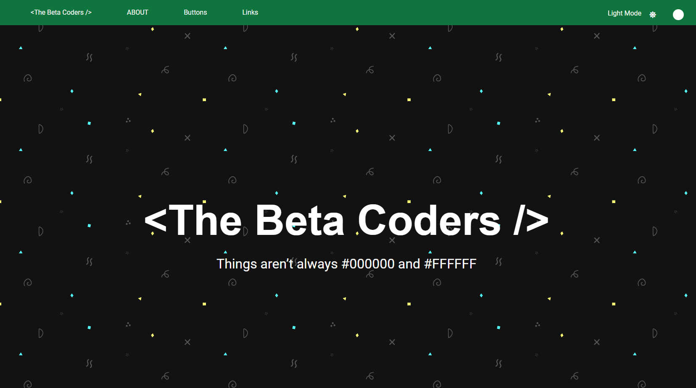

# Light & Dark Mode

The purpose of this project is to implement dark / light theme to a template website using plain JavaScript.

 

---

## Learning Outcome

 

1. Using CSS variables
2. `background: rgb(255 255 255 / 50%)` instead of `rgba(255, 255, 255, 0.5)`
3. Creating a [toggle switch](https://www.w3schools.com/howto/howto_css_switch.asp)
4. Setting attributes on the root element (html)
5. Using `document.documentElement`
6. Saving theme in localStorage
